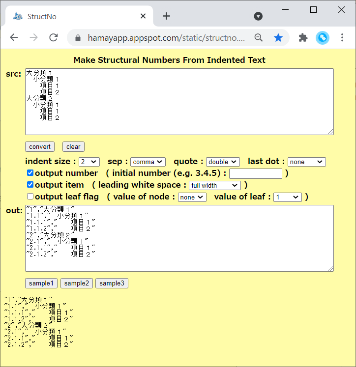

# StructNo

## 概要
- スペースでインデントされたテキストデータから、  
  階層化された項目番号 (1.2.3 等) を生成するための HTML です。

- 実行例は、以下のページにあります。  
  https://hamayapp.appspot.com/static/structno.html

## 使い方
- structno.html を ブラウザで開くと起動します。

- src のテキストボックスにテキストデータを貼り付けて、  
  convert ボタンをクリックすると、変換を実行します。  
  結果は、out のテキストボックスに表示されます。  
  (また、その下の空き領域にも表示されます)

- indent size コンボボックスでは、インデント 1 個に相当するスペースの数を指定します。

- sep (separator) コンボボックスでは、出力の項目間の区切り記号を指定します。  
  カンマ、タブ、スペース(半角) のいずれかを指定できます。

- quote コンボボックスでは、出力の各項目をクォートで囲って出力するかどうかを指定します。  
  none を選択すると、出力の各項目をクォートで囲いません。  
  single を選択すると、出力の各項目をシングルクォート(')で囲って出力します。  
  (このとき、データ内のシングルクォート自身は、連続するシングルクォート 2 個に変換されます)  
  double を選択すると、出力の各項目をダブルクォート(")で囲って出力します。  
  (このとき、データ内のダブルクォート自身は、連続するダブルクォート 2 個に変換されます)

- last dot コンボボックスでは、最終ドットの追加を行うかどうかを指定します。  
  none を選択すると、項目番号の最後にドット(.)を追加しません。  
  add を選択すると、項目番号の最後にドット(.)を追加します。  
  first only を選択すると、項目番号が第1階層のみのときだけ、ドット(.)を追加します。

- output number チェックボックスにチェックを入れると、  
  項目番号を出力します。

- initial number のテキストボックスでは、項目番号の初期値を指定できます。  
  例えば、3.4.5 のように入力すると、項目番号は 3.4.5 から開始します。  
  入力がなければ、各階層は 1 から開始します。  
  また、0 以下の数値を指定した場合も、1 から開始します。  
  (各階層は、(初期値の指定によらず) 終了すると 1 からに戻ります)

- output item チェックボックスにチェックを入れると、  
  項目内容を出力します。

- leading white space コンボボックスでは、項目内容を出力する際に、  
  行頭のスペースをどのように変換するかを指定します。  
  remove を選択すると、行頭のスペースを削除します。  
  preserve を選択すると、行頭のスペースをそのままにします。  
  half width を選択すると、インデントの数だけのスペース(半角)に置換します。  
  full width を選択すると、インデントの数だけのスペース(全角)に置換します。  
  half width x 2 を選択すると、インデントの 2 倍の数だけのスペース(半角)に置換します。  
  full width x 2 を選択すると、インデントの 2 倍の数だけのスペース(全角)に置換します。

- output leaf flag チェックボックスにチェックを入れると、  
  ノードもしくは葉の値を出力します。

- value of node コンボボックスでは、ノードの値を指定します。  
  ノードの値としては、なし, マイナス記号(-), 0, 1, 2 のいずれかを指定できます。

- value of leaf コンボボックスでは、葉の値を指定します。  
  葉の値としては、なし, マイナス記号(-), 0, 1, 2 のいずれかを指定できます。

- clear ボタンをクリックすると、入出力をすべてクリアします。

- sample1-3 ボタンをクリックすると、変換の例を表示します。

## 注意事項
1. 空行はそのまま出力します。

## 環境等
- OS
  - Windows 10 (version 20H2) (64bit)
- ブラウザ
  - Chrome v91

## 履歴
- 2020-8-11  v1.00 (初版)
- 2020-8-12  v1.01 一部処理見直し(文字列の繰り返し等)
- 2020-8-22  v1.02 クォートの選択項目を追加
- 2020-12-14 v1.03 ソースの空白見直し
- 2021-7-10  v1.04 初期番号設定のテキストボックスを追加
- 2021-7-11  v1.05 最終ドット種別のコンボボックスを追加

(2021-7-11)
